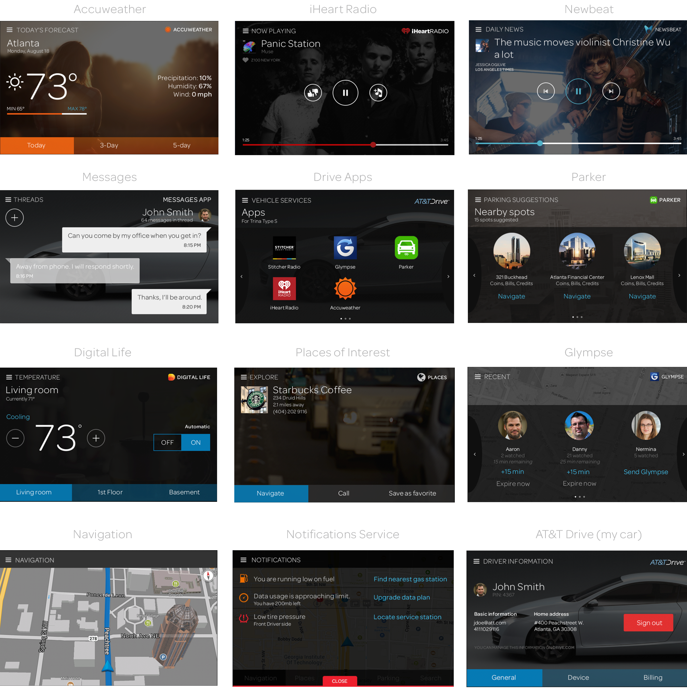

#AT&T Drive Head Unit SDK

- [Getting Started](Setup.md)
- [Developer Environent Virtual Machine](https://github.com/ericsson-innovate/ATT-Drive-SDK-VM)
- [Vehicle Head Unit API](VehicleAPI.md)
- [Out of car Apps API](http://ericsson-innovate.github.io/hackathon-portal/#/api-documentation)

## App examples

